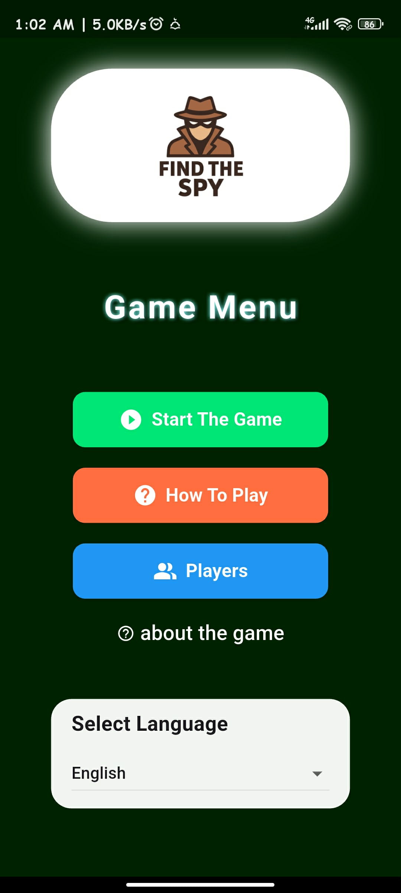

<p align="center">
  
</p>

# 🕵️‍♂️ Find The Spy

**Find The Spy** is a fun and engaging social party game built using **Flutter**.  
Players take on different roles to uncover who among them is the **Spy** — a player who secretly doesn’t know the secret word!  

Each round challenges observation, creativity, and communication as players ask and answer questions, trying to expose the Spy before they guess the secret word.

---

## 🎮 Game Overview

- **Players:** 3 or more  
- **Objective:**  
  - Normal players: Find out who the Spy is.  
  - The Spy: Stay undetected and guess the hidden word.  
- **Gameplay:**
  1. Choose a language (Arabic or English).
  2. Add player names.
  3. Select a category (e.g., Animals, Countries, Foods...).
  4. Everyone receives a secret word — except the Spy.
  5. Players ask each other questions to reveal the Spy.
  6. Vote and find out who the Spy is!

---

## 🧩 Features

✅ Dual language support (Arabic / English)  
✅ Simple and clean interface  
✅ Dynamic player name input  
✅ Random Spy assignment  
✅ Smart category and word selection  
✅ Smooth navigation with `StatefulWidgets`  
✅ Works on Android, iOS, and Web  

---

## 🛠️ Tech Stack

| Technology | Purpose |
|-------------|----------|
| **Flutter** | Cross-platform UI development |
| **Dart** | Programming language |
| **Material Design** | Modern app UI styling |
| **Stateful Widgets** | Game logic & state handling |

---

## 📂 Project Structure

```

find_the_spy/
├── lib/
│   ├── main.dart                # App entry point
│   ├── utils/                   # Used functions to help in game development
│   │   ├── generate_a_round.dart
│   │   ├── get_load_players.dart
│   │   ├── get_others.dart
│   │   ├── get_words.dart
│   ├── screens/
│   │   ├── home.dart            # Home screen
│   │   ├── categories.dart      # Category selection
│   │   ├── about.dart           # Informations about the game
│   │   ├── help.dart            # Information about how to play the game
│   │   ├── game/                # Pages related to the game when it is started 
│   │   │    ├── choices.dart
│   │   │    ├── intro.dart
│   │   │    ├── lobby.dart
│   │   │    ├── mission.dart
│   │   │    ├── points.dart
│   │   │    ├── round.dart
│   │   │    ├── round_with_vote.dart
│   │   │    ├── spy.dart
│   │   │    ├── vote.dart
│   └── widgets/                 # Shared components
├── assets/
│   └── images/                  # Game visuals (logo, icons)
├── pubspec.yaml                 # Dependencies & assets

````

---

## 🚀 Getting Started

### 1. Clone the repository
```bash
git clone https://github.com/yourusername/find_the_spy.git
cd find_the_spy
````

### 2. Install dependencies

```bash
flutter pub get
```

### 3. Run the app

```bash
flutter run
```

---
## 💡 Requirements
| Requirement                  | Version                      |
| ---------------------------- | ---------------------------- |
| **Flutter SDK**              | ≥ 3.0.0                      |
| **Dart SDK**                 | ≥ 2.19                       |
| **Android Studio / VS Code** | Recommended for development  |
| **Device / Emulator**        | Android, iOS, or Web browser |

---
## 🎨 Design Highlights

* Colorful and friendly interface
* Easy-to-read Arabic & English text
* Rounded buttons and smooth transitions
* Clean minimal layout for intuitive play

---

## 📱 Future Improvements

* [ ] Timer per round
* [ ] Custom categories
* [ ] Background music & sound effects
* [ ] Leaderboard

---

## 👨‍💻 Developer

**Developed by:** Souiki Zakarya Ayyoub (AK-47)
📧 Email: [[zakarya.ayyoub.souiki@gmail.com](mailto:zakarya.ayyoub.souiki@gmail.com)]
💼 GitHub: [https://github.com/SK-AYYOUB](https://github.com/SK-AYYOUB)

---

## 🪪 License

This project is licensed under the **MIT License** — you’re free to use, modify, and distribute it.

---

> “The best spy is the one nobody suspects.”
> *Find the Spy — test your wit, play with your friends, and outsmart the room!*
